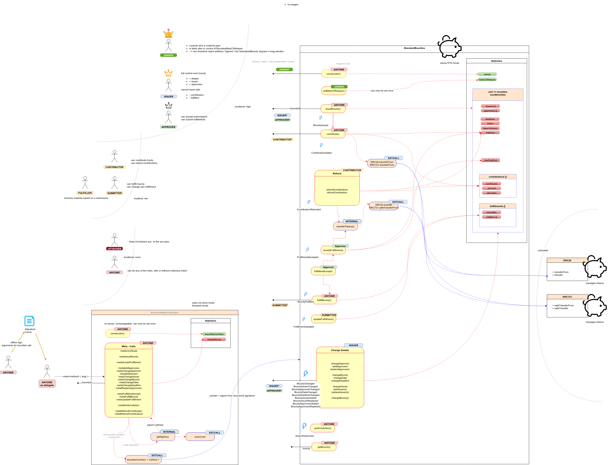

# Bounties Network Audit


<!-- Don't remove this -->
* [1 Summary](#1-summary)
  * [1.1 Audit Dashboard](#11-audit-dashboard)
  * [1.2 Audit Goals](#12-audit-goals)
  * [1.3 System Overview](#13-system-overview)
  * [1.4 Key Observations/Recommendations](#14-key-observationsrecommendations)
* [2 Issue Overview](#2-issue-overview)
* [3 Issue Detail](#3-issue-detail)
  * [3.1 ERC721 can be stolen in many cases](#31-erc721-can-be-stolen-in-many-cases)
  * [3.2 Misprint in updateFulfillment](#32-misprint-in-updatefulfillment)
  * [3.3 NFT with TokenID = 0 cannot be used](#33-nft-with-tokenid--0-cannot-be-used)
  * [3.4 ETH contributions don't work with meta transactions](#34-eth-contributions-dont-work-with-meta-transactions)
  * [3.5 Anyone can act as a contributor before any tokens of the contribution were sent](#35-anyone-can-act-as-a-contributor-before-any-tokens-of-the-contribution-were-sent)
  * [3.6 Use safe math for arithmetic operations](#36-use-safe-math-for-arithmetic-operations)
  * [3.7 Add tests for meta transactions functionality](#37-add-tests-for-meta-transactions-functionality)
  * [3.8 Make sure at least one issuer is set](#38-make-sure-at-least-one-issuer-is-set)
  * [3.9 Use correct sender when emitting events](#39-use-correct-sender-when-emitting-events)
  * [3.10 Incompatible ERC721Basic transferFrom() function](#310-incompatible-erc721basic-transferfrom-function)
  * [3.11 Safeguard contribute() against invalid bounty.tokenversion](#311-safeguard-contribute-against-invalid-bountytokenversion)
  * [3.12 Change public methods to external](#312-change-public-methods-to-external)
  * [3.13 Use the same transfer function for consistency](#313-use-the-same-transfer-function-for-consistency)
  * [3.14 Make contribute bail early if amount is zero](#314-make-contribute-bail-early-if-amount-is-zero)
  * [3.15 Require latest Solidity version](#315-require-latest-solidity-version)
  * [3.16 changeApprover/onlyIssuer can error if the list of approvers/issuers is empty](#316-changeapproveronlyissuer-can-error-if-the-list-of-approversissuers-is-empty)
  * [3.17 Explicitly declare State Variable Default Visibility](#317-explicitly-declare-state-variable-default-visibility)
  * [3.18 Use token interfaces instead of token implementation](#318-use-token-interfaces-instead-of-token-implementation)
  * [3.19 Rework project folder structure to reflect the sourceUnits role, use and purpose](#319-rework-project-folder-structure-to-reflect-the-sourceunits-role-use-and-purpose)
  * [3.20 Outdated documentation/specification](#320-outdated-documentationspecification)
  * [3.21 Do not save token address if tokenVersion is 0](#321-do-not-save-token-address-if-tokenversion-is-0)
* [4 Threat Model](#4-threat-model)
  * [4.1 Overview](#41-overview)
  * [4.2 Detail](#42-detail)
* [5 Tool based analysis](#5-tool-based-analysis)
  * [5.1 Mythril and Mythx](#51-mythril-and-mythx)
  * [5.2 Solhint](#52-solhint)
  * [5.3 Ethlint](#53-ethlint)
  * [5.4 Surya](#54-surya)
  * [5.5 Slither](#55-slither)
  * [5.6 Odyssey](#56-odyssey)
* [6 Test Coverage Measurement](#6-test-coverage-measurement)
* [Appendix 1 - File Hashes](#appendix-1---file-hashes)
* [Appendix 2 - Severity](#appendix-2---severity)
  * [A.2.1 - Minor](#a21---minor)
  * [A.2.2 - Medium](#a22---medium)
  * [A.2.3 - Major](#a23---major)
  * [A.2.4 - Critical](#a24---critical)
* [Appendix 3 - Disclosure](#appendix-3---disclosure)

<!-- Don't remove this -->

## 1 Summary

ConsenSys Diligence conducted a security audit on the smart contract system provided by the Bounties Network. This version adds a few new features to the existing smart contract: meta transaction support and ERC721 bounties.

<!-- Provide a headline description of what you have audited and what the goal or purpose of the audited project is.
Also add any other important context for the audit -->

### 1.1 Audit Dashboard

---


#### Audit Details

- **Project Name:** Bounties Network
- **Client Name:** Bounties Network
- **Client Contact:** Mark Beylin
- **Auditors:** Daniel Luca, Sergii Kravchenko, Martin Ortner, Dean Pierce
- **GitHub :** ConsenSys/bounties-audit-2019-03
- **Languages:** Solidity
- **Date:** March 22nd, 2019

#### Number of issues per severity


| |  |   |  |  | 
|:-------------:|:-------------:|:-------------:|:-------------:|:-------------:|
|  | **0**  |  **0**  | **0**  | **0** |
|  | **11**  |  **6**  | **2**  | **2** |


---

### 1.2 Audit Goals

The focus of the audit was to verify that the smart contract system is secure, resilient and working according to its specifications. The audit activities can be grouped in the following three categories:

**Security:** Identifying security related issues within each contract and within the system of contracts.

**Sound Architecture:** Evaluation of the architecture of this system through the lens of established smart contract best practices and general software best practices.

**Code Correctness and Quality:** A full review of the contract source code. The primary areas of focus include:

- Correctness
- Readability
- Sections of code with high complexity
- Improving scalability
- Quantity and quality of test coverage

### 1.3 System Overview

#### Documentation

The only documentation that was provided is in the form of source code comments.

#### Scope

The scope of the audit were the 2 active smart contracts:

|         File Name         |                SHA-1 Hash                |
| ------------------------- | ---------------------------------------- |
| BountiesMetaTxRelayer.sol | c2c00cd83814b2b2245d0354d613160db078ecae |
| StandardBounties.sol      | ad89921694268dfeba8e7bb1fedf7242bacda8ac |

Commit hash is `3d7c1771f78c5afdd896e2e2d34cf3dfc7fd4813`

#### Design

The `StandardBounties` contract contains the full functionality and represents the bounty registry; it holds the ERC20, ERC721 tokens and ether which represent the bounty reward.

`BountiesMetaTxRelayer` is a trusted meta transaction relayer that extracts the address of a signed message and calls the corresponding function in the `StandardBounties` contract.

### 1.4 Key Observations/Recommendations

#### Positive Observations

The code is written in a clear manner, groups modifiers, events, public and internal functions, making the codebase easy to audit. The repository contains a fair number of truffle tests that increase the confidence in the codebase and functionality correctness. It implements new features on the Bounties Network platform that might increase the adoption and usability of the platform.

#### Recommendations

##### Write tests for meta transactions

There are no written tests that check the meta transactions functionality. It will be useful to test this because they will guide the front-end implementation and will validate that the smart contracts in their current form are usable and self sufficient.

Along with adding tests for meta transactions the developer will realize he needs to make some changes to the code to handle **relayed ether bounties**. The current version does not do this because the ether is not relayed to the `StandardBounties` contract.

##### Reimplement handling of ERC721 tokens

The ERC721 tokens are handled as ERC20 tokens (for the most part). They should be handled differently because they are a different kind of tokens. Fungible tokens (ERC20) have some properties that do not apply to non fungible tokens (ERC721). The biggest change would be creating a map linking bounties and assigned ERC721 tokens instead of summing token IDs to handle ownership. This will change the code in multiple places and will generate significant amount work that needs to be audited once again. Take the time and carefully plan this reimplementation.

##### Remove unused code

Cleanup the repository by removing the token smart contracts and replacing them with only the interfaces. This decreases the reader's scope (whether the reader is a person or a tool) and makes clear the intention of the source files included in the repository, they should only define the token interfaces that are used in the `StandardBounties` smart contract.

##### Update documentation

Having good comments inside the contract is great but having dedicated documentation is better. We have provided a few diagrams that you can use or might inspire you to describe the system.

## 2 Issue Overview

The following table contains all the issues discovered during the audit. The issues are ordered based on their severity. More detailed description on the levels of severity can be found in Appendix 2. The table also contains the Github status of any discovered issue.

| Chapter | Issue Title  | Issue Status | Severity |
| ------------- | ------------- | ------------- | ------------- |
 | 2.1 | [ERC721 can be stolen in many cases](#31-erc721-can-be-stolen-in-many-cases) |  **Closed** |  **Critical** | 
 | 2.2 | [Misprint in updateFulfillment](#32-misprint-in-updatefulfillment) |  **Closed** |  **Critical** | 
 | 2.3 | [NFT with TokenID = 0 cannot be used](#33-nft-with-tokenid-=-0-cannot-be-used) |  **Closed** |  **Major** | 
 | 2.4 | [ETH contributions don't work with meta transactions](#34-eth-contributions-dont-work-with-meta-transactions) |  **Closed** |  **Major** | 
 | 2.5 | [Anyone can act as a contributor before any tokens of the contribution were sent](#35-anyone-can-act-as-a-contributor-before-any-tokens-of-the-contribution-were-sent) |  **Closed** |  **Medium** | 
 | 2.6 | [Use safe math for arithmetic operations](#36-use-safe-math-for-arithmetic-operations) |  **Closed** |  **Medium** | 
 | 2.7 | [Add tests for meta transactions functionality](#37-add-tests-for-meta-transactions-functionality) |  **Closed** |  **Medium** | 
 | 2.8 | [Make sure at least one issuer is set](#38-make-sure-at-least-one-issuer-is-set) |  **Closed** |  **Medium** | 
 | 2.9 | [Use correct sender when emitting events](#39-use-correct-sender-when-emitting-events) |  **Closed** |  **Medium** | 
 | 2.10 | [Incompatible ERC721Basic transferFrom() function](#310-incompatible-erc721basic-transferfrom()-function) |  **Closed** |  **Medium** | 
 | 2.11 | [Safeguard contribute() against invalid bounty.tokenversion](#311-safeguard-contribute()-against-invalid-bounty-tokenversion) |  **Closed** |  **Minor** | 
 | 2.12 | [Change public methods to external](#312-change-public-methods-to-external) |  **Closed** |  **Minor** | 
 | 2.13 | [Use the same transfer function for consistency](#313-use-the-same-transfer-function-for-consistency) |  **Closed** |  **Minor** | 
 | 2.14 | [Make contribute bail early if amount is zero](#314-make-contribute-bail-early-if-amount-is-zero) |  **Closed** |  **Minor** | 
 | 2.15 | [Require latest Solidity version](#315-require-latest-solidity-version) |  **Closed** |  **Minor** | 
 | 2.16 | [changeApprover/onlyIssuer can error if the list of approvers/issuers is empty](#316-changeapproveronlyissuer-can-error-if-the-list-of-approversissuers-is-empty) |  **Closed** |  **Minor** | 
 | 2.17 | [Explicitly declare State Variable Default Visibility](#317-explicitly-declare-state-variable-default-visibility) |  **Closed** |  **Minor** | 
 | 2.18 | [Use token interfaces instead of token implementation](#318-use-token-interfaces-instead-of-token-implementation) |  **Closed** |  **Minor** | 
 | 2.19 | [Rework project folder structure to reflect the sourceUnits role, use and purpose](#319-rework-project-folder-structure-to-reflect-the-sourceunits-role,-use-and-purpose) |  **Closed** |  **Minor** | 
 | 2.20 | [Outdated documentation/specification](#320-outdated-documentationspecification) |  **Closed** |  **Minor** | 
 | 2.21 | [Do not save token address if tokenVersion is 0](#321-do-not-save-token-address-if-tokenversion-is-0) |  **Closed** |  **Minor** | 


## 3 Issue Detail

### 3.1 ERC721 can be stolen in many cases

| Severity  | Status |  Remediation Comment |
| ------------- | ------------- | ------------- |
|  **Critical**  |  **Closed**   | The issue has been closed |


**Description**

ERC721 tokens are misused in many ways. One of the most critical issues related to it, is the opportunity to steal almost any token. In order to do so, you need to create your own bounty and contribute your token (or multiple tokens) so the sum of your tokenIDs will be no less than tokenID of the desired token: 


**contracts/StandardBounties.sol:L416**

```Solidity
      require(bounties[_bountyId].balance >= _tokenAmounts[i]); // Checks that the bounty has a sufficient balance to make the payout
```


After that, you just need to pay yourself with the desired token using function `acceptFulfillment`. You will not be able to return your previous tokens easily, but usually, you can find tokens with a lower value but greater tokenID than the desired token.

A lot of other issues will also come up while using ERC721 tokens. 

Even with non-malicious usage, the sum of tokenIDs will overflow in many cases:


**contracts/StandardBounties.sol:L246**

```Solidity
    bounties[_bountyId].balance += _amount; // Increments the balance of the bounty
```


> While some ERC-721 smart contracts may find it convenient to start with ID 0 and simply increment by one for each new NFT, callers SHALL NOT assume that ID numbers have any specific pattern to them, and MUST treat the ID as a "black box" [EIP-721](https://github.com/ethereum/EIPs/blob/master/EIPS/eip-721.md)

That will cause different unexpected behavior that mostly leads to blocked tokens.

**Remediation**

Change the implementation of ERC721 tokens everywhere. Stop using `balance` and `amount` values when working with these tokens. Keep track of all ERC721 tokenIDs that were submitted to a specific bounty and allow to reward fulfillers only with tokens from that list.

### 3.2 Misprint in updateFulfillment

| Severity  | Status |  Remediation Comment |
| ------------- | ------------- | ------------- |
|  **Critical**  |  **Closed**   | The issue has been closed |


**Description**

In `updateFulfillment` function anyone can update `fulfillers` list of the `fulfillments[_bountyId]` and nobody can update their own fulfillment (except for owner of `fulfillments[_bountyId]`). 


**contracts/StandardBounties.sol:L377**

```Solidity
    bounties[_bountyId].fulfillments[_bountyId].fulfillers = _fulfillers;
```


If `fulfillments[_bountyId]` gets reward using `acceptFulfillment` function, it can be frontrunned by anyone and all the bounty that should have gone to the original fulfillers can be stolen.

**Remediation**

Change 
```solidity 
bounties[_bountyId].fulfillments[_bountyId].fulfillers = _fulfillers;
```
 to 
```solidity
bounties[_bountyId].fulfillments[_fulfillmentId].fulfillers = _fulfillers;
```

### 3.3 NFT with TokenID = 0 cannot be used

| Severity  | Status |  Remediation Comment |
| ------------- | ------------- | ------------- |
|  **Major**  |  **Closed**   | The issue has been closed |


**Description**

1. Function `acceptFulfillment` that is responsible for sending rewards, has the following lines of code:


**contracts/StandardBounties.sol:L420-L422**

```Solidity
      if (_tokenAmounts[i] != 0){
        transferTokens(_bountyId, fulfillment.fulfillers[i], _tokenAmounts[i]);
      }
```


2. Similar issue with `issueBounty` function:


**contracts/StandardBounties.sol:L218-L220**

```Solidity
    if (_depositAmount > 0){
      contribute(_sender, bountyId, _depositAmount);
    }
```


3. And with `contribute` function:


**contracts/StandardBounties.sol:L248**

```Solidity
    require(_amount > 0); // Contributions of the amount 0 should fail
```


That means that ERC721 with tokenID = 0 can't be transferred in many places.

**Remediation**

Avoid these checks in case of ERC721.

This issue might become obsolete if handling of ERC721 token is reimplemented.

### 3.4 ETH contributions don't work with meta transactions

| Severity  | Status |  Remediation Comment |
| ------------- | ------------- | ------------- |
|  **Major**  |  **Closed**   | The issue has been closed |


**Description**

Contribution with meta transaction does not work if a bounty handles ether. In order to contribute, the sender needs to transfer ether to the bounties contract, but in meta transactions, no value is sent.

**Remediation**

Transfer ether value inside `metaContribute` and `metaIssueBounty` functions.

### 3.5 Anyone can act as a contributor before any tokens of the contribution were sent

| Severity  | Status |  Remediation Comment |
| ------------- | ------------- | ------------- |
|  **Medium**  |  **Closed**   | The issue has been closed |


**Description**

Token transferring in `contribute` function is happening after the contribution was processed and added into StandardBounties contract:


**contracts/StandardBounties.sol:L243-L262**

```Solidity
    bounties[_bountyId].contributions.push(
      Contribution(_sender, _amount, false)); // Adds the contribution to the bounty

    bounties[_bountyId].balance += _amount; // Increments the balance of the bounty

    require(_amount > 0); // Contributions of the amount 0 should fail

    if (bounties[_bountyId].tokenVersion == 0){
      require(msg.value == _amount);
    } else if (bounties[_bountyId].tokenVersion == 20) {
      require(msg.value == 0); // Ensures users don't accidentally send ETH alongside a token contribution, locking up funds
      require(ERC20Token(bounties[_bountyId].token).transferFrom(_sender,
                                                                 address(this),
                                                                 _amount));
    } else if (bounties[_bountyId].tokenVersion == 721) {
      require(msg.value == 0); // Ensures users don't accidentally send ETH alongside a token contribution, locking up funds
      ERC721BasicToken(bounties[_bountyId].token).transferFrom(_sender,
                                                               address(this),
                                                               _amount);
    }
```


That means that in some types of tokens that may allow reentrancy in `transferFrom` function (ERC777 tokens or regulated/controlled tokens), an attacker can act as a contributor of any amount of tokens even before he actually transferred these tokens.
No serious vulnerabilities were found that allows the attacker to steal funds, but the attacker can borrow all of the StandardBounties balance of this particular token and then return it back in the same transaction. Even though these funds need to be returned in the end, they can be used for other attacks for example.
In order to do that, the attacker should do the following steps:
1. Create his own bounty
1. Try to contribute any huge amount of tokens, the balance of the bounties contract for example.
1. Do the reentrancy inside `transferFrom` function of the token (for example callback to `sender` in ERC777 token) and refund the contribution inside this reentrancy call.
1. After refunding, all the balance of bounties contract will be sent to the attacker.
1. By the end of the transaction, the attacker should be able to return all the tokens to complete the initial transaction successfully, but he can use these tokens in the meantime.

**Remediation**

Adding mutex to all external functions of the StandardBounties contract will protect the system from any kind of reentrancy attack.

### 3.6 Use safe math for arithmetic operations

| Severity  | Status |  Remediation Comment |
| ------------- | ------------- | ------------- |
|  **Medium**  |  **Closed**   | The issue has been closed |


**Description**

For internal bookkeeping `StandardBounties` is keeping track of a bounty's total balance. The total balance is the sum of the amount of individual contributions. While it is unlikely that this amount may overflow for contributions in ETH (uint256_MAX) it may be be possible for `ERC20` tokens where a user might have an arbitrarily sized stake in the token.

Total bounty balance is calculated when contributing tokens:  


**contracts/StandardBounties.sol:L246**

```Solidity
    bounties[_bountyId].balance += _amount; // Increments the balance of the bounty
```


Total bounty balance is calculated when refunding tokens:  


**contracts/StandardBounties.sol:L294**

```Solidity
    bounties[_bountyId].balance -= contribution.amount;
```


Total bounty balance is calculated while paying out bounty:  


**contracts/StandardBounties.sol:L418**

```Solidity
      bounties[_bountyId].balance -= _tokenAmounts[i];
```


**Remediation**

It is recommended to use vetted safe math libraries for arithmetic operations consistently throughout the smart contract system.

**References**

* https://smartcontractsecurity.github.io/SWC-registry/docs/SWC-101

### 3.7 Add tests for meta transactions functionality

| Severity  | Status |  Remediation Comment |
| ------------- | ------------- | ------------- |
|  **Medium**  |  **Closed**   | The issue has been closed |


**Description**

No tests for meta transactions exist at the moment. When writing tests or doing the actual implementation the smart contract _might_ adapt to accommodate developer needs. This has the risk of introducing bugs or security issues.

**Remediation**

Add tests for meta transactions.

### 3.8 Make sure at least one issuer is set

| Severity  | Status |  Remediation Comment |
| ------------- | ------------- | ------------- |
|  **Medium**  |  **Closed**   | The issue has been closed |


**Description**

When creating a bounty, or changing the bounty an empty list of issuers can be set. In that case the bounty is frozen because nobody can update it. Approvers can still disburse funds if they are set, otherwise the funds and the bounty is completely locked.

Not having any issuers can be considered a feature, nobody can change the bounty, but **not having any issuers and any approvers** is a problem because the bounty is locked.


**contracts/StandardBounties.sol:L200-L201**

```Solidity
    newBounty.issuers = _issuers;
    newBounty.approvers = _approvers;
```


**contracts/StandardBounties.sol:L486-L487**

```Solidity
    bounties[_bountyId].issuers = _issuers;
    bounties[_bountyId].approvers = _approvers;
```


**Remediation**

Revert if `_issuers.length == 0` and `_approvers.length == 0`.
```solidity
require(_issuers.length != 0 && _approvers.length != 0);
```


### 3.9 Use correct sender when emitting events

| Severity  | Status |  Remediation Comment |
| ------------- | ------------- | ------------- |
|  **Medium**  |  **Closed**   | The issue has been closed |


**Description**

Wrong sender when emitting event.


**contracts/StandardBounties.sol:L564**

```Solidity
    emit BountyDataChanged(_bountyId, msg.sender, _data); // The new _data is emitted within an event rather than being stored on-chain for minimized gas costs
```


**contracts/StandardBounties.sol:L542-L545**

```Solidity
    emit BountyApproverChanged(_bountyId,
              msg.sender,
              _approverId,
              _approver);
```


The events should be emitted by the sender which sometimes can be the one relayed by `BountiesMetaTxRelayer`.

**Remediation**

`msg.sender` should be changed to `_sender`.

### 3.10 Incompatible ERC721Basic transferFrom() function

| Severity  | Status |  Remediation Comment |
| ------------- | ------------- | ------------- |
|  **Medium**  |  **Closed**   | The issue has been closed |


The hardcoded reference in the bounties code defines transferFrom as 
```transferFrom(address _from, address _to, uint256 _tokenId) public returns(bool);```

Whereas the standard is 
```transferFrom(address _from, address _to, uint256 _tokenId) public;```

here:


**contracts/inherited/ERC721Basic.sol:L215**

```Solidity
  function transferFrom(address _from, address _to, uint256 _tokenId) public returns(bool);
```


vs:


**contracts/token/ERC721/ERC721Basic.sol:L76**

```Solidity
  function transferFrom(address _from, address _to, uint256 _tokenId) public;
```


or more recently:


**contracts/token/ERC721/IERC721.sol:L23**

```Solidity
    function transferFrom(address from, address to, uint256 tokenId) public;
```


#### Remediation

Update the reference to remove the return value, and consider referencing these sorts of interfaces remotely.

### 3.11 Safeguard contribute() against invalid bounty.tokenversion

| Severity  | Status |  Remediation Comment |
| ------------- | ------------- | ------------- |
|  **Minor**  |  **Closed**   | The issue has been closed |


**Description**

This is a case that normally should never happen as the `tokenversion` is validated when issuing a bounty at:


**contracts/StandardBounties.sol:L195**

```Solidity
    require(_tokenVersion == 0 || _tokenVersion == 20 || _tokenVersion == 721); // Ensures a bounty can only be issued with a valid token version
```


In order to make the code resilient to potential future errors introduced with changes to `issueBounty` it is recommended to throw an exception in the else path of the token selection in `contribute` for an invalid `bounty.tokenversion`.


**contracts/StandardBounties.sol:L250-L268**

```Solidity
    if (bounties[_bountyId].tokenVersion == 0){
      require(msg.value == _amount);
    } else if (bounties[_bountyId].tokenVersion == 20) {
      require(msg.value == 0); // Ensures users don't accidentally send ETH alongside a token contribution, locking up funds
      require(ERC20Token(bounties[_bountyId].token).transferFrom(_sender,
                                                                 address(this),
                                                                 _amount));
    } else if (bounties[_bountyId].tokenVersion == 721) {
      require(msg.value == 0); // Ensures users don't accidentally send ETH alongside a token contribution, locking up funds
      ERC721BasicToken(bounties[_bountyId].token).transferFrom(_sender,
                                                               address(this),
                                                               _amount);
    }

    emit ContributionAdded(_bountyId,
                           bounties[_bountyId].contributions.length - 1, // The new contributionId
                           _sender,
                           _amount);
  }
```


**Remediation**

`contribute()` should throw an exception if the bounty specifies an invalid `tokenversion`.

### 3.12 Change public methods to external

| Severity  | Status |  Remediation Comment |
| ------------- | ------------- | ------------- |
|  **Minor**  |  **Closed**   | The issue has been closed |


**Description**

A number of functions are declared as `public` but can be changed to `external`.

StandardBounties:

- setMetaTxRelayer
- issueBounty
- refundContributions
- performAction
- updateFulfillment
- fulfillAndAccept
- changeBounty
- changeIssuer
- changeApprover
- changeData
- changeDeadline
- addIssuers
- replaceIssuers
- addApprovers
- replaceApprovers
- getBounty

MetaTxRelayer:

- metaIssueBounty
- metaContribute
- metaRefundContribution
- metaRefundContributions
- metaPerformAction
- metaFulfillBounty
- metaUpdateFulfillment
- metaAcceptFulfillment
- metaFulfillAndAccept
- metaChangeBounty
- metaChangeIssuer
- metaChangeApprover
- metaChangeData
- metaChangeDeadline
- metaAddIssuers
- metaReplaceIssuers
- metaAddApprovers
- metaReplaceApprovers

**Remediation**

Change visibility to `external`.

### 3.13 Use the same transfer function for consistency

| Severity  | Status |  Remediation Comment |
| ------------- | ------------- | ------------- |
|  **Minor**  |  **Closed**   | The issue has been closed |


**Description**

There are 2 places in the source code where an ERC721 transfer happens. In one place the `transferFrom()` method is used, in the other the `safeTransferFrom()` method is used. 


**contracts/StandardBounties.sol:L694-L696**

```Solidity
      ERC721BasicToken(bounties[_bountyId].token).safeTransferFrom(address(this),
                                                                   _to,
                                                                   _amount);
```


**contracts/StandardBounties.sol:L259-L261**

```Solidity
      ERC721BasicToken(bounties[_bountyId].token).transferFrom(_sender,
                                                               address(this),
                                                               _amount);
```


**Remediation**

If there is no other reason, the `transferFrom()` method should be used in both places.


### 3.14 Make contribute bail early if amount is zero

| Severity  | Status |  Remediation Comment |
| ------------- | ------------- | ------------- |
|  **Minor**  |  **Closed**   | The issue has been closed |


**Description**

The method `contribute()` takes an argument `_amount`. Zero contributions are not allowed. In case `_amount` is zero the code would first push the contribution to the bounties contribution array then update the bounties balance just to find out that the `_amount` is zero and throw an exception. 


**contracts/StandardBounties.sol:L243-L248**

```Solidity
    bounties[_bountyId].contributions.push(
      Contribution(_sender, _amount, false)); // Adds the contribution to the bounty

    bounties[_bountyId].balance += _amount; // Increments the balance of the bounty

    require(_amount > 0); // Contributions of the amount 0 should fail
```


**Remediation**

For the purpose of gas usage optimization it is suggested to bail early by moving this specific `require(_amount > 0);` statement to the beginning of the method.


### 3.15 Require latest Solidity version

| Severity  | Status |  Remediation Comment |
| ------------- | ------------- | ------------- |
|  **Minor**  |  **Closed**   | The issue has been closed |


**Description**

Solidity is very active pushing out new versions. Make sure to include the latest stable version that does not break any things.

**Remediation**

At the moment of writing this the latest stable version is [0.5.6](https://github.com/ethereum/solidity/releases/tag/v0.5.6)

### 3.16 changeApprover/onlyIssuer can error if the list of approvers/issuers is empty

| Severity  | Status |  Remediation Comment |
| ------------- | ------------- | ------------- |
|  **Minor**  |  **Closed**   | The issue has been closed |


 **Description**

***`changeApprover`***

The `StandardBounties` contract provides an interface to allow an issuer of a bounty to change an existing approver by calling `changeApprover(_sender, _bountyId, _issuerId, _approverId, 
_approver)`. The caller provided arguments are validated, however the checks for `_approverId` in modifier `validateApproverArrayIndex` are too relaxed.


**contracts/StandardBounties.sol:L85-L91**

```Solidity
  modifier validateApproverArrayIndex(
    uint _bountyId,
    uint _index)
  {
    require(_index < bounties[_bountyId].approvers.length || _index == 0);
    _;
  }
```


The modifier checks if `_index` is a valid index of `bounties[_bountyId].approvers` but it also allows the index to be zero even though the array `bounties[_bountyId].approvers` might be empty. This could result in an EVM-Error while trying to access an empty array at index zero.


**contracts/StandardBounties.sol:L527-L540**

```Solidity
  function changeApprover(
    address _sender,
    uint _bountyId,
    uint _issuerId,
    uint _approverId,
    address payable _approver)
    public
    senderIsValid(_sender)
    validateBountyArrayIndex(_bountyId)
    validateIssuerArrayIndex(_bountyId, _issuerId)
    onlyIssuer(_sender, _bountyId, _issuerId)
    validateApproverArrayIndex(_bountyId, _approverId)
  {
    bounties[_bountyId].approvers[_approverId] = _approver;
```


A caller trying to change an approver for a bounty that has no approvers specified yet (`bounties[_bountyId].approvers` is an empty array) will result in an EVM error that is not caught by the input validation modifier `validateApproverArrayIndex`. `bounties[_bountyId].approvers` is allowed to be empty when initially issuing a bounty by calling `issueBounty()`. Approvers can be changed after issuing a bounty by calling `changeBounty()`. Both methods allow approvers to be an empty array.

***`onlyIssuer`***

`onlyIssuer` can error in the same way if a bounty does not specify any `issuers` and someone calls any of the functions decorated `validateIssuerArrayIndex ` and `onlyIssuer` with an `_issuerId` of zero. The array bounds check in `validateIssuerArrayIndex()` explicitly allows `_issuerId` to be zero even though the array is empty and the subsequent call to `onlyIssuer` then tries to access the first item of an empty array.


**contracts/StandardBounties.sol:L77-L83**

```Solidity
  modifier validateIssuerArrayIndex(
    uint _bountyId,
    uint _index)
  {
    require(_index < bounties[_bountyId].issuers.length || _index == 0);
    _;
  }
```


**contracts/StandardBounties.sol:L93-L100**

```Solidity
  modifier onlyIssuer(
  address _sender,
  uint _bountyId,
  uint _issuerId)
  {
  require(_sender == bounties[_bountyId].issuers[_issuerId]);
  _;
  }
```


**Remediation**

Change the modifier `validateApproverArrayIndex()` to strictly fail for indices that are out of bounds, disallowing an array access at index zero if the array is empty (out of bounds).
 


**contracts/StandardBounties.sol:L89**

```Solidity
    require(_index < bounties[_bountyId].approvers.length || _index == 0);
```


change to

```
require(_index < bounties[_bountyId].approvers.length);
```

### 3.17 Explicitly declare State Variable Default Visibility

| Severity  | Status |  Remediation Comment |
| ------------- | ------------- | ------------- |
|  **Minor**  |  **Closed**   | The issue has been closed |


**Description**

Explicitly declaring the state variables default visibility makes it easier to catch incorrect assumptions about who can access the variable. It also makes the code less dependent on compiler defaults that may be subject to change increasing maintainability of the code. The default visibility for the following state variables are not explicitly declared:

`StandardBounties`


**contracts/StandardBounties.sol:L46-L47**

```Solidity
  address owner; // The address of the individual who's allowed to set the metaTxRelayer address
  address metaTxRelayer; // The address of the meta transaction relayer whose _sender is automatically trusted for all contract calls
```


`BountiesMetaTxRelayer`


**contracts/BountiesMetaTxRelayer.sol:L10**

```Solidity
  StandardBounties bountiesContract;
```


**Remediation**

Variables can be specified as being `public`, `internal` or `private`. Make a conscious decision and explicitly define visibility for all state variables.

**References**
* https://smartcontractsecurity.github.io/SWC-registry/docs/SWC-108

### 3.18 Use token interfaces instead of token implementation

| Severity  | Status |  Remediation Comment |
| ------------- | ------------- | ------------- |
|  **Minor**  |  **Closed**   | The issue has been closed |


**Description**

The `StandardBounties` contract is using ERC20 and ERC721 interfaces to handle bounty rewards for the fulfillers.


**contracts/StandardBounties.sol:L4-L5**

```Solidity
import "./inherited/ERC20Token.sol";
import "./inherited/ERC721Basic.sol";
```


Even though the generated bytecode does not include the tokens' byte code, the source code is not needed and it's cleaner to only have the tokens' interfaces.

**Remediation**

Remove `ERC20Token.sol` and `ERC721Basic.sol` files and use the EIP20 and EIP721 interfaces provided by OpenZeppelin or ConsenSys.

ERC20:
- [EIP20 OpenZeppelin](https://github.com/OpenZeppelin/openzeppelin-solidity/blob/master/contracts/token/ERC20/IERC20.sol)
- [EIP20 ConsenSys](https://github.com/ConsenSys/Tokens/blob/master/contracts/eip20/EIP20Interface.sol)

ERC721:
- [EIP721 OpenZeppelin](https://github.com/OpenZeppelin/openzeppelin-solidity/blob/master/contracts/token/ERC721/IERC721.sol)
- [EIP721 ConsenSys](https://github.com/ConsenSys/Tokens/blob/feat/eip721/contracts/eip721/EIP721Interface.sol)

### 3.19 Rework project folder structure to reflect the sourceUnits role, use and purpose

| Severity  | Status |  Remediation Comment |
| ------------- | ------------- | ------------- |
|  **Minor**  |  **Closed**   | The issue has been closed |


**Description**

It is suggested to rework the folder structure of `./contracts` to naturally describe the sourceUnits and contracts role, use and purpose as part of the system. The subfolder `./contracts/inherited/` suggests that the base contracts inherit from the contracts in that folder, which is not the case.

The main contracts are:
* `StandardBounties.sol` - does not inherit from other contracts; imports other source files to use contracts as interface (`ERC721`, `ERC20`)
* `BountiesMetaTxRelayer.sol` - does not inherit from other contracts; imports other source files to use contracts as interface (`StandardBounties`)
* `HumanStandardToken.sol` - appears to be used with the test-suite only

**Remediation**

* move contracts that are only used as part of the test-suite to `./contracts/test/` (`HumanStandardToken` appears to be only used with the test-suite)
* move common functionality and/or libraries to a descriptive subfolder of `./contracts/common/` or `./contracts/lib/`. (`ERC20Token`, `ERC721Basic`, `Token`)
* retain the folder `./contracts/inherited` for interface or inherited contracts

### 3.20 Outdated documentation/specification

| Severity  | Status |  Remediation Comment |
| ------------- | ------------- | ------------- |
|  **Minor**  |  **Closed**   | The issue has been closed |


#### Description 

The documentation/specification in `Readme.md` and `./docs` is outdated and does not reflect the actual contract system. A clear specification of the system supports the auditing process and allows auditors and any other reader to verify the code adheres to the specification.

#### Examples

The last change to `Readme.md` was a year ago.
The following functions are mentioned in the documentation but do not exist in code.

- killBounty()
- issueAndActivateBounty()
- increasePayout()

#### Remediation 

Update the documentation providing a clear specification of the system.


### 3.21 Do not save token address if tokenVersion is 0

| Severity  | Status |  Remediation Comment |
| ------------- | ------------- | ------------- |
|  **Minor**  |  **Closed**   | The issue has been closed |


**Description**

A `token` can be saved even if the `tokenVersion` is set as `0`, which represents ether bounties. The ether bounties do not use an external contract as a ledger.


**contracts/StandardBounties.sol:L203-L204**

```Solidity
    newBounty.token = _token;
    newBounty.tokenVersion = _tokenVersion;
```


In this case, when `getBounty()` is called it will also return the `token` initially set. Even if the address is not used, it can create a bit of confusion.

**Remediation**

A check can be added in the `issueBounty()` method
```solidity
require(_tokenVersion == 0 || _tokenVersion == 20 || _tokenVersion == 721); // Ensures a bounty can only be issued with a valid token version

if (_tokenVersion == 0) {
    require(_token == address(0));
}
```


## 4 Threat Model

The creation of a threat model is beneficial when building smart contract systems as it helps to understand the potential security threats, assess risk, and identify appropriate mitigation strategies. This is especially useful during the design and development of a contract system as it allows to create a more resilient design which is more difficult to change post-development.

A threat model was created during the audit process in order to analyze the attack surface of the contract system and to focus review and testing efforts on key areas that a malicious actor would likely also attack. It consists of two parts a high level design diagram that help to understand the attack surface and a list of threats that exist for the contract system.

The Bounties Network smart contract system enables anyone to create a bounty and safely distribute the rewards. The following Threat Model is an abstraction of the current system and has been compiled based on the understanding of how the smart contracts have been implemented. It does not claim completeness and can be considered as a complementary analysis type to the manual code review and automated tool analysis.

### 4.1 Overview

#### System components

The Bounties Network system has a few components that are deployed by the Bounties Network team or by a third party.

- **StandardBounties**: See chapter [1.3 System Overview](#13-system-overview)
- **BountiesMetaTxRelayer**: See chapter [1.3 System Overview](#13-system-overview)
- **ERC20 / ERC721 contracts**: These contracts hold token balances and they can be bounty rewards.

#### Actors

A list of actors has been created:

- **Issuer**: Has complete control over the bounty, can edit any of its parameters, including but not limited to changing the list of issuers, approvers and other bounty details.
- **Approver**: Is allowed to accept the fulfillment submitted to a bounty, effectively sending rewards to fulfillers.
- **Fulfiller**: Receives rewards based on a submission.
- **Submitter**: Submits fulfillments, which contain a list of fulfillers' addresses.
- **Contributor**: Contributes with funds to the bounty, increasing the bounty size.
- **StandardBounties Owner**: Can set once the `metaTxRelayer` as being smart contract relaying meta transactions.

#### Assets

Assets need to be protected and must be disbursed as rewards by the approvers. They must be protected, as potential threats could result in considerable loss for actors as well as loss of trust in the system.
The following assets were identified:

- **ERC20 / ERC721 tokens and ether**: bounty rewards, owned by contributors.
- **Signed meta transactions**: generated by the original address that wants to initiate actions on the system, owned by original address and the relayer.
- **StandardBounties**: contract owner account can set `MetaTxRelayer`
- **Bounty metadata**: IPFS hashes of JSON data structures composed of mandatory and optional fields.

#### Threats

- Because all of the bounties are stored in the same smart contract, finding a security issue in the system can put all bounties at risk. At the moment we're fairly sure the system is safe (apart from the issues we already described), but future updates can add problems to the system.
  - **Risk**: High
  - **Mitigation**: Audit each change to the system.

- The `MetaTxRelayer` may be used to call `StandardBounties` with various unpredictable (ecrecover) addresses. This can effectively grief the MetaTxRelayer account, draining the ether that is needed to pay for the transaction fee.
  - **Risk**: Medium
  - **Mitigation**: We cannot suggest a mitigation because the relayer component is not yet built.

- An attacker can hack any one of the issuers or approvers (or an issuer gone rogue) and remove all other issuers from the bounty, add themselves as an approver, fulfil the bounty and run off with the funds. The risk is limited to the current bounty only.
  - **Risk**: Low
  - **Mitigation**: A high value bounty can be managed by a multi-sig contract that requires a sufficiently high number of signers to make actions on the Bounties Network platform. Because this needs significant setup, one should only do this with high value bounties.

- Someone could front-run a fulfilment. By cloning another fulfillment and paying more gas to make sure your transaction is picked up by the miners before the original transaction, your fulfillment will be displayed before the original one on the website. The approver will not be able to know which is the original submission.
  - **Risk**: Medium
  - **Mitigation**: Delaying the IPFS metadata submission on the web front-end until the transaction was mined can mitigate this problem. This assumes a `fulfiller` property exists in the metadata and uniquely identifies the original fulfiller.

- Someone may collect all IPFS metadata hashes from calls to StandardBounties to collect personal data (optional e-mail, name, ...) of participants. This can also raise concerns over data privacy and GDPR compliance.
  - **Risk**: Low
  - **Mitigation**: Consider encrypting the metadata using an asymmetric encryption scheme.

- Malicious users can impersonate other users on the platform by creating accounts with the same name and picture.
  - **Risk**: Low
  - **Mitigation**: Make the trustworthiness "Network Stats" more visible on the bounty website UI.

- Anyone can trigger the `ActionPerformed` event.
  - **Risk**: Low
  - **Mitigation**: Consider restricting access to it if possible.

- Information emitted or stored within the contract may break assumptions in the context of the website.
  - **Risk**: Medium
  - **Mitigation**: Sanitize and validate the user provided data before using it on the website.

### 4.2 Detail

A detailed overview of the system has been created and it contains all of the methods contained in the system and the actors.



## 5 Tool based analysis

The issues from the tool based analysis have been reviewed and the relevant issues have been listed in chapter 3 - Issues.

### 5.1 Mythril and Mythx


#### Mythril

Mythril is a security analysis tool for Ethereum smart contracts. It uses concolic analysis to detect various types of issues. The tool was used for automated vulnerability discovery for all audited contracts and libraries. More details on Mythril's current vulnerability coverage can be found [here](https://github.com/ConsenSys/mythril/wiki).

The raw output of the Mythril vulnerability scan can for smart contracts did not find anything and can be found [here](./tool-output/mythril/).

#### MythX

MythX is a security analysis API for Ethereum smart contracts. It performs multiple types of analysis, including fuzzing and symbolic execution, to detect many common vulnerability types. The tool was used for automated vulnerability discovery for all audited contracts and libraries. More details on MythX can be found at [mythx.io](https://mythx.io).

MythX was run on the on the flattened `BountiesMetaTxRelayer` which contains all of the contracts in the audit's scope. The raw output can be found [here](./tool-output/mythx/mythx_report.md).

### 5.2 Solhint


This is an open source project for linting Solidity code. The project provides both Security and Style Guide validations. The issues of Solhint were analyzed for security relevant issues only. It is still recommended to use Solhint during development to improve code quality while writing smart contracts.

The raw output of the Solhint vulnerability scan can be found [here](./tool-output/solhint/solhint_report.md).

### 5.3 Ethlint


[Ethlint](https://www.ethlint.com/) is an open source project for linting Solidity code. Only security-related issues were reviewed by the audit team.

The raw output of the Ethlint vulnerability scan can be found [here](./tool-output/ethlint/ethlint_report.md).

### 5.4 Surya

Surya is a utility tool for smart contract systems. It provides a number of visual outputs and information about the structure of smart contracts. It also supports querying the function call graph in multiple ways to aid in the manual inspection and control flow analysis of contracts.

A complete list of functions with their visibility and modifiers can be found [here](./tool-output/surya/surya_report.md).

### 5.5 Slither

Slither is a static analysis framework for quickly finding interesting solidity issues in smart contracts, and printing out the relevant properties.

Issues found by Slither can be found [here](./tool-output/slither/slither.md), as well as a [function summary](./tool-output/slither/slither-function-summary.md) and information about [variables and authentication](./tool-output/slither/slither-vars-and-auth.md).

### 5.6 Odyssey


Odyssey is an audit tool that acts as the glue between developers, auditors and tools. It leverages Github as the platform for building software and aligns to the approach that quality needs to be addressed as early as possible in the development life cycle and small iterative security activities spread out through development help to produce a more secure smart contract system.
In its current version Odyssey helps to better communicate audit issues to development teams and to successfully close them.

## 6 Test Coverage Measurement

The test-suite is implemented using Truffle and consists of 255 individual tests in three token specific suites covering `ETH`, `ERC20` and `ERC721` token handling of the system. 

Executing the [test-suite](./tool-output/test-suite/test-results.md#Test-Suite---Output) yields **<u>six failing test-cases</u>** caused by calling the non-existent function `getBountyFulfillments()` of contract `StandardBounties`. 

* Failure to detect failing test-cases can have severe operative and security related consequences and must be avoided under all circumstances. It is therefore recommended to make sure the test-suite is run for every release candidate, ideally automated as part of a CI/CD pipeline. It is further recommended to set-up the CI system to annotate every change that is proposed to the system with test-suite results (i.e. indicate test-suite errors for github pull-requests). 
* In order to provide more accurate coverage statistics we provide a [patch](./tool-output/test-suite/test-results.md#Test-Suit---Fix) fixing the test-suite.
* The [fixed test-suite](./tool-output/test-suite/test-results.md#Fixed-Test-Suite---Output) passes for all of the 255 test-cases.
* The test-suite is homogeneously, mainly focussed on testing specific units and appears to be lacking a set of negative tests and broader focussed integration tests. Test-cases often initialize an empty `StandardBounties` registry to perform very specific tests on. While this is okay for unit-tests it is recommended to also provide broader test-cases to cover variations of unique internal states (e.g. an empty registry, a registry with multiple empty bounties, a registry with multiple empty, non-empty bounties with issuers/approvers/.. being set/empty). More variation allows to better cover the fact that with potential future code one bounty might have an effect on other bounties during various calls (modifiers checking certain assumptions, functions looping over approvers/issuers/...). 

Code coverage metrics indicate the amount of lines/statements/branches that are covered by the test-suite. It's important to note that "100% test coverage" is not a silver bullet. Our review also included an inspection of the test suite to ensure that testing included important edge cases. Be aware that code coverage does not provide information about the individual test-cases quality.

For code coverage to be generated it was required to install the missing dependency `ethereumjs-testrpc-sc`. For details please refer to the [coverage statistics console output](./tool-output/test-suite/coverage-statistics.md) and the [coverage statistics html output](./coverage-reports/index.html).

* The code coverage of `49.12%` for Statements, `37.67%` for Branches, `59.26%` for Functions and `43.75%` Lines is very low. 
* The main contributing fact to the low coverage statistics is that `BountiesMetaTxRelayer.sol` is not covered at all. It is strongly recommended to fully cover this sourceUnit before releasing using the system.
* `StandardBounties.sol` yields an overall coverage of  `~94%` (`~80%` branch coverage).
  *  `StandardBounties.setMetaTxRelayer()` and `StandardBounties.refundContributions()` are not covered by any tests (e.g. `setMetaTxRelayer()` can only be called once and successfully stores the MetaTxRelayer address) 
  * `onlySubmitter()` and `hasNotPaid()` are only partially covered, missing tests covering the case that the `require` assertion may be violated.
  * `issueBounty()` is missing a test for an invalid `_tokenversion`.
  * `contribute` is missing a test for someone contributing an invalid amount.
  * `contribute` is missing a test for the case that due to an error someone might be able to contribute to a bounty that specifies an invalid token.
  * `transferTokens` is missing a test for the scenario that an external call to `ERC20.transfer()` might return `false` and therefore fail.
  * `transferTokens` is missing a test verifying that trying to transfer tokens for bounty with an invalid `tokenversion` reverts.
  * `acceptFulfillment()` is missing a test for the case that the bounty does not have sufficient balance to make the payout.
  * `acceptFulfillment()` is missing a test case for the case that the beneficiary of the bounty may receive zero tokens (item in `_tokenAmounts[]` is zero; verify receiver does not receive any tokens).


Both test coverage and quality are rather weak. One module is seriously lacking coverage. Only `80%-94%` of the code of the main contract is covered. In general we recommend to strive for a 100% coverage on all modules relevant to the system before releasing it. A smart contract system carries considerable risk and it should by all means be avoided to not being able to detect undesired, interface and assumption breaking or security relevant changes. The test-suite should consist of both unit specific and integration tests explicitly verifying security relevant assumptions, negative cases and edge-cases.


## Appendix 1 - File Hashes

The SHA1 hashes of the source code files in scope of the audit are listed in the table below.

|         File Name         |                SHA-1 Hash                |
| ------------------------- | ---------------------------------------- |
| BountiesMetaTxRelayer.sol | c2c00cd83814b2b2245d0354d613160db078ecae |
| StandardBounties.sol      | ad89921694268dfeba8e7bb1fedf7242bacda8ac |

## Appendix 2 - Severity

### A.2.1 - Minor

Minor issues are generally subjective in nature, or potentially deal with topics like "best practices" or "readability". Minor issues in general will not indicate an actual problem or bug in code.

The maintainers should use their own judgment as to whether addressing these issues improves the codebase.

### A.2.2 - Medium

Medium issues are generally objective in nature but do not represent actual bugs or security problems.

These issues should be addressed unless there is a clear reason not to.

### A.2.3 - Major

Major issues will be things like bugs or security vulnerabilities. These issues may not be directly exploitable, or may require a certain condition to arise in order to be exploited.

Left unaddressed these issues are highly likely to cause problems with the operation of the contract or lead to a situation which allows the system to be exploited in some way.

### A.2.4 - Critical

Critical issues are directly exploitable bugs or security vulnerabilities.

Left unaddressed these issues are highly likely or guaranteed to cause major problems or potentially a full failure in the operations of the contract.

## Appendix 3 - Disclosure

ConsenSys Diligence (“CD”) typically receives compensation from one or more clients (the “Clients”) for performing the analysis contained in these reports (the “Reports”). The Reports may be distributed through other means, including via ConsenSys publications and other distributions.

The Reports are not an endorsement or indictment of any particular project or team, and the Reports do not guarantee the security of any particular project. This Report does not consider, and should not be interpreted as considering or having any bearing on, the potential economics of a token, token sale or any other product, service or other asset. Cryptographic tokens are emergent technologies and carry with them high levels of technical risk and uncertainty. No Report provides any warranty or representation to any Third-Party in any respect, including regarding the bugfree nature of code, the business model or proprietors of any such business model, and the legal compliance of any such business. No third party should rely on the Reports in any way, including for the purpose of making any decisions to buy or sell any token, product, service or other asset. Specifically, for the avoidance of doubt, this Report does not constitute investment advice, is not intended to be relied upon as investment advice, is not an endorsement of this project or team, and it is not a guarantee as to the absolute security of the project. CD owes no duty to any Third-Party by virtue of publishing these Reports.

PURPOSE OF REPORTS The Reports and the analysis described therein are created solely for Clients and published with their consent. The scope of our review is limited to a review of Solidity code and only the Solidity code we note as being within the scope of our review within this report. The Solidity language itself remains under development and is subject to unknown risks and flaws. The review does not extend to the compiler layer, or any other areas beyond Solidity that could present security risks. Cryptographic tokens are emergent technologies and carry with them high levels of technical risk and uncertainty.

CD makes the Reports available to parties other than the Clients (i.e., “third parties”) -- on its Github account (https://github.com/ConsenSys). CD hopes that by making these analyses publicly available, it can help the blockchain ecosystem develop technical best practices in this rapidly evolving area of innovation.

LINKS TO OTHER WEB SITES FROM THIS WEB SITE You may, through hypertext or other computer links, gain access to web sites operated by persons other than ConsenSys and CD. Such hyperlinks are provided for your reference and convenience only, and are the exclusive responsibility of such web sites' owners. You agree that ConsenSys and CD are not responsible for the content or operation of such Web sites, and that ConsenSys and CD shall have no liability to you or any other person or entity for the use of third party Web sites. Except as described below, a hyperlink from this web Site to another web site does not imply or mean that ConsenSys and CD endorses the content on that Web site or the operator or operations of that site. You are solely responsible for determining the extent to which you may use any content at any other web sites to which you link from the Reports. ConsenSys and CD assumes no responsibility for the use of third party software on the Web Site and shall have no liability whatsoever to any person or entity for the accuracy or completeness of any outcome generated by such software.

TIMELINESS OF CONTENT The content contained in the Reports is current as of the date appearing on the Report and is subject to change without notice. Unless indicated otherwise, by ConsenSys and CD.
